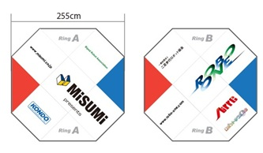
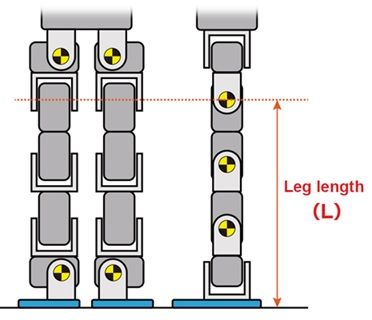
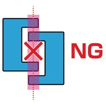

### 28th robo-one light rule _Ver3.2_

  

- (1)V1_2024/12/12作成
- (2)V1.1_2025/2/3修正 
- (3)V2.0_2025/5/2改定
- (4)V3.0_2025/11/26改定(予選方法の大幅改定)
- (5)V3.1_2025/12/10改訂(パイロンの変更と詳細の追加、予選の一部追加)
- (6)__V3.2_2025/12/18改訂(しゃがみ状態の規定改定)__
  
# 第28回ROBO-ONE Light競技規則　V3.1
## 1.前文
ROBO-ONEの目的は、「ロボットの楽しさ」をより多くの人に広めることである。観客がロボットや試合を楽しむことができ、参加者の意欲を掻き立てるロボット競技を目指す。そのため、試合の勝ち負けよりも技術的な素晴らしさやエンターテイメント性を重視する。  
また、ロボット技術の普及と健全な発展を目指すため、技術情報はできるだけ公開する。

## 2.ROBO-ONEの精神について
ROBO-ONEは多くの参加者がともに学び、楽しむために下記の志を尊重します。参加者は下記の気持ちを持って参加してください。
- ロボット作りを楽しもう。
- 新しい技術を学び、積極的に取り込もう。
- 感動を与えるロボット作りを目指そう。
- 公正で楽しいファイトをしよう。
- 安全で人を傷つけないロボットを作ろう。
- 互いのロボットに敬意を持ち、参考にしよう。

## 3.競技とは
競技は、定められたリング内において、出場者が製作した二足歩行ロボットを用い試合を行い、レフリーおよび審査員の判定によって勝敗を決めるものである。
競技は、トーナメント方式の本選とそれに先立つ予選からなる。

## 4.リングの規格および環境
### 4.1.リング
リングのサイズは大リング(図4-1)と小リング(図4-2)があり、会場の状況などを判断しいずれかで試合を進行する。寸法はそれぞれ記載のとおりである。

表面の状態は±3mm以下の段差とし材質は特に規定しない。

リング上部2m、リングの周囲30cm、周囲30cmのリング面下30cmまでは物を配置しない。選手およびそのロボットの関係者はレフリーの許可なくリングのこのエリアに近づいてはならない。  
ただしレフリーはこの範囲も自由に動けるものする。(図4-3参照)

(図4-1)大リングの場合

(図4-2)小リングの場合

 

(図4-3)横から見た図

### 4.2.環境外乱
一般観戦者や報道関係者、競技関係者の使用する撮影機器に対して、特に規制を設けない。そのため、室内照明、太陽光、カメラ・ビデオの赤外線・フラッシュ、撮影用照明等が出場ロボットに影響を受けるおそれのあるときは、出場者は各自対策を立てておくこと。

## 5.ロボットの規格
ロボットの形状は、以下の規定に抵触しない限り自由とする。ただし、二つの脚、二つの腕、胴体(と頭)で構成されること。二つの脚および二つの腕にはそれぞれ一軸以上の稼働軸を持つこと。
### 5.1.移動方法
- (a)当競技規則では「歩行」と「移動」を使い分けて記載している。「歩行」は左右の脚を交互に上げて移動することを指す。「移動」は「歩行」に限らず、ロボットがその場から別の場へ脚を使って移動することを指す。また、「歩行」ではない旋回はすべて「移動」に含まれる。なおリングには5mm程度の段差を設ける場合がある。
- (b)レフリーの指示があった場合、30秒以内に前後にそれぞれ90cm以上歩行しなければならない。既定の歩行ができない場合は、1ダウンを与え2分間の修正時間を与える。修正ができない場合はノックアウトとなる。
- (c)移動するときは、腕をリングの床面から50mm以上離した状態で移動すること。
- (d)起き上がり中を含め試合中のしゃがみ移動を禁止する。しゃがみ移動をした場合は、イエローカードの対象となる。

### 5.2.しゃがみ状態
- (a)しゃがみ状態とは、膝に該当する関節 （逆関節の場合も同様）を90度以下、または股に該当する関節を左右あわせて90度以上開いた状態をしゃがみ状態とする。ひざ関節にサーボを2個~~使用している場合も同様である。~~ __以上使用している場合は隣り合う軸と結ぶ線の角度が90度以下の場合(図5-1のように3つの角度を規定することになる。)をしゃがみ状態とする。足首については(c)で定める。__
- (b)しゃがみ状態における移動をしゃがみ移動、歩行をしゃがみ歩行、攻撃をしゃがみ攻撃と定義する。
- (c)移動、攻撃のときは、(a)に加えて、両脚の足首関節が同時に45度以下（逆関節の場合も同様）となるときしゃがみ状態とする。ただし大技および起き上がり動作はこの限りではない。
- (d)歩行時の遊脚については膝関節は90度以下でも良い。
- (e)ファイティングポーズ(11.1.1-a)においては、(a)に加えて、足首関節が45度以下となることを禁止する。

図5-1 横から見た図

図5-2 前から見た図

### 5.3 移動の方向
- (a)ロボットの前後、左右は、上体から離れて動く両脚のヨー軸平面に直行する方向をロボットの前後方向と判断する。ヨー軸がない場合は、ピッチ軸で判断する（図5-3）。また、ロボットが直立した状態における、足裏規定の足裏の向きによりロボットの前後左右を判定する（図5-4）。  ロボットの前後方向に移動することを、前進移動、後進移動とし、左右方向に移動することを左移動、右移動とする。また、この競技規則の各項目おいても、この前後左右の規定が適用される。

  

図5-3 ピッチ軸

図5-4　移動方向

#### 5.4 ロボットの重量
- (a)ロボットの重量は1.2kg以下(autoの場合は1.5kg以下)とする。バッテリーなど競技中にロボットに搭載するものすべて含む。

#### 5.5 足・脚の規定
- (a)	足裏(地面に接地する部分)のサイズを規定する。足裏の前後の長さは、脚の長さの50%以下としその最大長さは10cmとする。  足裏の左右の長さは脚の長さの30%以下とする。脚の長さとは、脚部の最上部にある、前後に動く軸から足裏までの長さとし、脚を伸ばした状態で長さを計測する。

脚の長さ　= L  
足裏の前後の長さ　L * 50% (max 10cm)  
足裏の左右の長さ　L * 30%  

図5-5 脚の長さ

図5-6　足の大きさ

- (b)ロボットが立った状態で、上から見た足裏の最外周を結ぶ線が左右の足で重ならないこと。(図5-7参照)

図5-7 足の形状

- (c)吸引吸着装置（粘着物も含む）を足の裏に設けてはならない。

#### 5.6　腕の規定 
- (a) 胴体から離れて動く部位（脚を除く腕、頭など）の長さは 胴体の中心から離れて動く部位の先端までの長さZを25cm以下とする。長さの計測は左右に伸ばした状態で行う。頭については10cm以下とする。なお公認ロボットの場合は公認ロボットの規格に準じる。
- (b)ロボットの手先にアクリル板など透明な素材を使用する場合は、レフリーや審査員が手先の位置を確認しやすくするために、テープや塗装で周囲を囲うこと。

図5-8 腕の形状

#### 5.7 安全基準
- (a)バッテリー、基板、電源ケーブルはカバーで囲われており、露出していないこと。
- (b)バッテリーは胴体(body)に収納すること。
- (c)ケーブルは、足や腕に沿った配線とし空中配線となる場合はケーブルを束ねるなど安全を考慮した配線とすること。
- (d)即座にかつ安全に電源を切れるように、バッテリーとロボットの間にスイッチを設けること。
- (e)バッテリーの安全管理のため、会場内で使用するすべてのバッテリーを競技開始までに審査をうけること。バッテリー本体が極端に膨らんでいる、または本体、ケーブル、コネクタの痛みがひどい、など重大な事故につながる危険性があると判断された場合は、使用できない。
安全が確認できたバッテリーは、「確認シール」を貼り付ける。これがない場合は使用できないためイベント終了まで張り付けること。確認シールがないバッテリーの使用、及び充電していることが分かった時点で、出場停止とする。

図5-9　確認シール

- (f)危険な状態と判断された場合はレッドカード(1ダウン)となり、2分以内に修復不能な場合はテクニカルノックアウトとなる。発火、発煙は即時にテクニカルノックアウトとなる。例えば、試合中にバッテリーカバーが外れバッテリーが剥き出しになった場合は、レフリーは危険と判断し修復を求める。この時点で1ダウンとなり、修復時間はタイムの規定と同様2分となる。この時、重量増や重心位置の変更はできない。
  
#### 5.8 禁止事項
- (a)鉛/鉄板など機能に関係のない重量物の搭載を禁止する。
- (b)妨害電波発生装置、または、レーザー、ストロボ等、相手のコントロールを故意に乱す装置を内蔵してはならない。ロボットへの眩しいほどの高輝度LED等の搭載は操縦者への妨害光と判断される。ただしレーザーレンジセンサーなどのセンシング機器は除く。
- (c)発火装置を内蔵してはならない。
- (d)物や液体、粉末および気体を内蔵し、相手に吹き付ける装置をセットしてはならない。
- (e)刃物や高速で回転するものなど危ないものは禁止とする。またロボットの高速で回転するファン、プロペラなどを使用し、飛行あるいは移動することを禁止する。CPUの冷却ファンなどはこの限りではない。
- (f)人を傷つける部位があってはならない。金属バリの処理を実施のこと。
- (g)引っかける構造、あるいは粘着性の強い素材を持つ手、腕の装着を禁止する。規格審査では粘着性については紙が張り付くかどうかで判定し厳しく審査する。
- (h)リングを傷つけたり、汚したりする部品を使用してはならない。
- (i)メンテナンス以外のリングへの過度な接触、リング上に上がることを禁止する。
- (j)装飾をする場合は、ロボットが直立時および移動時にリングに触れない長さに収めること。
- (k)規定に反するとレフリーが判断した場合は1ダウンとし、2分以内の修正時間があたえられる。
- (l)上記以外でも、ロボットに対して、審査員・レフリーがROBO-ONEの精神に反すると判断した場合は規格外とする。

#### 5.9	ロボットの構造変更の禁止
予選、決勝トーナメントを通してロボットに手を加え、形状を変更してはならない。部品の交換やテーピングなどは許されるが部品の追加や取り外しは重量変更を伴うため禁止とする。

#### 5.10	模倣形状の禁止
二足歩行ロボット協会にて許諾を得ていない既存のキャラクター及び人物を模した造形のロボット、及びイラスト、写真等の使用を禁止する。また、著作権を有する楽曲（本人による歌唱、鼻歌等を含む）、音声、及び商標登録のある名称、又はそれに酷似したものを使用してはならない。

必要な場合は、参加者個人の責任において許諾を取得すること。また、許諾を受けた場合は、事前に二足歩行ロボット協会へ連絡をすること。

#### 5.11	政治思想に関連する表現、公序良俗に反する内容を禁止する。
下記の内容を禁止する。違反した場合は、即時失格とし会場から退場とする。
- (a)	政治的、宗教上の主張をPRするものや広告宣伝等を目的としたロボットの装飾、参加者の服装、パフォーマンスなど。
- (b)	二足歩行ロボット協会が認めていない個人の氏名、特定の国・地域・団体などをPRするものや広告宣伝等を目的としたロボットの装飾、参加者の服装、パフォーマンスなど。ただし、学校名、部活名、サークル名、（企業名、商品名などを含まない）チーム名はこの限りではない。
- (c)	公序良俗に反するロボットの装飾、参加者の服装、パフォーマンスなど。
- (d)	防犯のため、会場内で顔全体を覆うマスク等の装着を禁止する。

## 6. 公認ロボットの規格
- (a)	二足歩行ロボット協会が公認した市販ロボットであること。
『ROBO-ONEオフィシャルサイト』公認ロボットページ
  https://www.robo-one.com/authrobots/
- (b)	ROBO-ONE公式 WEB サイトに掲載された各公認ロボットに規定されたルールに従うこと。
- (c)	ROBO-ONE 公式 WEB サイトに掲載された公認オプションパーツ以外のオプションパーツを使用してはならない。ただし、足裏へのグリッフ向上のための素材の貼り付けを認める。公認オプションパーツが販売終了で入手できない場合は、同形状、同重量相当の自作パーツを装着することができる（事前に申請すること）。
- (d)	改造は、着色、シール張付、性能の向上が発生しない外装パーツの取り付け及び紙・布・プラスチック・スポンジの外装、およびソフトウェア的変更は可とする。電飾、センサーなどの搭載や制御用マイコンの載せ替えについても可とする。
- (e)	公認ルール内の改造、装飾をする場合、重量増を20%まで、胴体の中心から腕の先端までの長さは左右それぞれ最大300mmに収めること。ただし重量は2kgを超えてはならない。

- (f)	サーボのトルクは、対応電圧範囲の最大電圧で20kgf・cm未満とする。
- (g)	公認ロボットを利用してautoで参加する場合は、CPUボードやカメラの追加搭載のため、(e)項で既定の20％増+300gまでの重量増を認める。またこれら搭載のため、安全規定を満たす範囲内での改造を認める。autoで参加する場合の重量は、最大2.3kgまでとする。

## 7. ロボットの操縦方法
### 7.1	予選・決勝操縦方法
- (a)予選、決勝は、コンピュータによる自律操縦、人間による手動操縦のどちらでもかまわない。ただし、LightクラスはROBO-ONE Light ランキング 10 位までのロボットビルダーはautoまたは公認機の無改造(シールの貼り付けや塗装は可とする。)ロボットでの参加を可とする（学生は除く）。なお公認ロボットで参加する場合は、初心者育成のため、試合終了後3か月以内にモーション等を公開するものとする。

- (b)手動操縦する場合は、ワイヤレス(無線、赤外線など)操縦とする。選手は試合環境(光・音・電波)を考慮し、対戦相手が同じシステムを使っても操縦に支障が無いようにしなければならない。尚、小電力・微弱無線操縦の場合は、8ｃｈ以上の周波数を持つ無線システムとすること。
- (c)2.4GHz帯、5GHz帯の認可された無線LAN, Bluetooth, Zigbee,ADバンド(25MHz微弱20バンド)なども使用可能。開催国内で認可されていない無線の使用は禁止とする。

### 7.2 autoの作動方法
- (a)autoで参加する場合、ロボットは、ロボットに搭載されたセンサーやコンピュータによる自律動作でなければならない。
- (b)レフリーの"始め"の合図で動作を開始し、"待て"あるいは"止め"の合図で動作を停止するように製作すること。この時、および試合の停止期間中は、人間からの無線による始動、停止、脱力指示が許される。レフリーは、ロボットが完全に停止するまで触れることはできない。
- (c)試合中はコントローラにも触れてはならない。したがって素早くロボットを停止あるいは脱力させるためコントローラを首からぶら下げるなどの対応を行うこと。試合中に指示なく無線機に触れた場合はイエローカードの対象となる。また、試合中にロボットが暴走するなどレフリー、または審査員が危険な処理と判断した場合は、ロボットの停止を指示する場合がある。その場合は、選手自身が即時に無線、または手動で停止させること。人間に危険が伴う場合は、協議の結果失格になる場合がある。

## 8	予選の方法
### 8.1	予選ビーチフラッグバトル
- (a) 最大径120mm、高さ220mmの赤い円錐形パイロン(下図参照)を奪い合うビーチフラッグバトルを予選として実施する。

図8.1 Pylon Side View(肉厚はすべて0.75mm)

図8.2 Pylon Top View
   
- (b)3～5体（原則4体）が小型リングのレフリー指定する位置（原則４隅）からスタートし、3分間でパイロンを奪い合い、競技時間の終了時点でパイロンを両腕で確保しているロボットを勝者とする。試合時間中、全てのロボットは自由に攻撃することができパイロンを確保したロボットから奪うことができる。競技終了時点でパイロンを確保しているロボットがいない場合、パイロンの底面に最も足裏が近いロボットを勝者とする。なお、複数の機体がパイロンを確保していた場合は、パイロンのより太い位置側を確保しているロボットを勝者といる。更に判定が困難な場合は、レフリー・審査員により勝者を決定する。
- (c)予選競技開始後、レフリーが10カウントをしている間、リング中央の90cm四方以外の場所（パイロンのある場所)を時計回りに歩行していなければならない（移動ではなく、足を挙げての歩行動作とし、しゃがみによる歩行・移動も禁止とする）また、10カウントの歩行時間内に転倒した場合、すぐに起き上がり歩行を続ける。歩行が全くできない場合（あるいはレフリーが歩行と判断できなかった場合）失格とする。
- (d)予選競技開始後、レフリーの10カウント以降はダウン/スリップの判定せず、しゃがみ攻撃や寝技も許可する。なお、ロボットが以下の状態になった場合、レフリーの判断で失格とする。
  - ロボットに戦意が無いとレフリーが判断した場合
  - バッテリーが露出した場合などレフリーが危険だと判断した場合
  - ロボットが脱力できない場合やコントロール不能になった場合
  - ロボットが著しく損傷した場合
- (e)パイロン自体がリングアウトした場合、レフリーがリングの中心にパイロンを戻し競技は継続される。また、予選競技終了直前にパイロンがリングアウトし終了となった場合、レフリーがリングの中心にパイロンを戻した後レフリーが10カウントによる試合継続、10カウント後(b)の条件で勝者を決定する。
- (f)ロボット同士が絡み合って動けない状態になった場合、該当ロボットはレフリーの指示でを脱力状態にし、レフリーがロボットを離したあと、その場所から競技を再開する。
- (g)ロボットが対戦相手の攻撃、また、自身の攻撃、歩行、起き上がり動作でリングアウトした場合、競技には復活できない。
- (h)autoで決勝トーナメントに参加する予定のロボットも、ビーチフラッグバトル予選時は無線操縦を認める。
- (i)ランキング3位までの選手と認定権を取得している選手は、予選ビーチフラッグバトルに参加することはできない。

## 9.	極小リングバトル (今大会では実施しない。)
- (a) 約90cm×40cmに区切られた範囲内で戦う。先に相手ロボットからダウンを奪った方を勝者とする。また、延長戦は即実施するものとし、バッテリー交換などメンテナンスは認めない。「極小リングバトル」中のイエローカードは勝敗の判定に反映する。
- (b)	延長戦の「極小リングバトル」は通常のバトルと同じルールが適用される。ただし、延長戦の試合時間は30秒とする。
- (c)	延長戦の「極小リングバトル」の開始位置は、レフリーの指示に従いそれぞれのコーナーに置く。
- (d)	「極小リングバトル」では、体の一部が区切りのテープ外に 機体の一部が触れた場合をリングアウトとし、その時点で相手の勝利とする。
- (e) テープは試合開始前からリングに貼ったまま進行する。

## 10.決勝トーナメント
- (a)	試合は一般に3分１ラウンド制とし、“ノックダウン”　または　“ダウン数”　によって試合を争う。参加台数等の都合により試合時間を変更する場合がある。
- (b) 時間内にノックダウンとならない場合はダウン数の差のみで勝敗を決める。
- (c) ダウンカウントが同じでイエローカードの枚数が同じ場合は2分間の延長戦により先にダウンを奪った方の勝利とする。
- (d) アルティメイトタイムは延長戦を含めて実施する。

## 11.試合規則
### 11.1 試合進行時の規定
### 11.1.1 試合進行
- (a) 試合開始にあたりロボットは準備ができたことを示すファイティングポーズをとる。ダウンやスリップなど10カウントから復帰した場合も同様のファイティングポーズをとるまでカウントは継続される。
- (b) 試合開始は「はじめ」、試合終了は「止め」、試合を停止する場合は「待て」とレフリーがコールする。この時、レフリーは必要に応じ時間を止める。再開する場合は「はじめ」をコールする。相手がダウンまたはスリップから(スリップ、スタンディング)起き上がった後は「ファイト」の合図で攻撃を開始できる。
- (c) 試合開始までの準備時間は2分以内とし、これを超えた場合は棄権とする。ただし、準備時間中に選手、または代理人による遅刻の申請があった場合は、選手の準備完了を待つこととする。準備時間が過ぎた時点で1ダウンとなり、以後2分ごとにレッドカードを与える。
- (d) 試合中レフリーがタイマーを止めた時、レフリーの指示がなくてもロボットをトルクオフしてもよい。トルクオフをした場合は、レフリーの指示により速やかに試合を再開できるように待機すること。
- (e) レフリーの指示がない限り時間計測は止めない。
- (f) リングには赤と青コーナーがあり、トーナメント表の左側が赤、右側を青とする。なお縦書きのトーナメントの場合は上を赤、下を青とする。
- (g) ロボットの技術的な素晴らしさやエンターテイメント性を観戦者に楽しんでもらうため、また配信映像記録として利用するために、競技中の出場者の立ち位置範囲を規制する。

### 11.1.2 ぺナルティ
- (a) レフリーは状況に応じ、イエローカードやレッドカードを発行するが、イエローカード２枚でレッドカード1枚となる。レッドカードは１回の“ダウン”と同等に扱う。
- (b) 競技規則内で、ペナルティが明記されていない項目は、イエローカードが適用される。

### 11.1.3 試合の勝敗
- (a) ダウン後、レフリーが行う10カウントでダウンから復帰できない場合をノックアウト (K.O.)とし、その時点で、その試合を相手のものとする。またラウンドのタイムアウト後もカウントは継続する。
- (b) 相手がダウンした場合は相手の起き上がりを妨げない距離に離れなければならない。autoにおいても同じルールを採用するため、相手がダウンしていることに検出できるようにすること。相手の起き上がりを妨害したり、ダウンしているときは攻撃したりすることはイエローカードの対象となる。ただしROBO-ONE autoの場合は相手が起き上がれば、レフリーの指示がなくても、攻撃することを可とする。
- (c) 同一試合内で3回ダウンした場合、その時点でノックアウト とし、その試合を相手のものとする。
- (d) 試合中のギブアップはレフリーに申告する。その他、レフリーが試合続行不能と判断した場合にはテクニカルノックアウトを宣告できる。
- (e) ダウンカウントが同じ場合はイエローカードの枚数が少ない方を勝者とする。

### 11.1.4	ダウンの規定
- (a)	有効な攻撃によって相手が倒れた場合のみ　“ダウン”　とみなす。
- (b)	リングアウトした場合は、１回の　“ダウン”　と同等に扱われる。
- (c)	有効な攻撃で　“ダウン”　した後の立ち上がり動作中にリングアウトした場合は、ダウン数にカウントしない。

### 11.1.5 スリップの規定
- (a) ダウンとならない転倒や攻撃の反動で転倒する場合は、スリップとしダウンではない。ただしレフリーの10カウント中に起き上がれない場合はノックアウトとなる。またラウンドのタイムアウト後もカウントは継続する。両者が同時に起き上がれない場合は延長戦を行う。
- (b) ロボットが転倒していなくても、足裏以外がリングに触れた場合はスリップとなり、多発する場合はイエローカードの対象になる。
- (c) 転倒により両ロボットが重なり合って倒れた場合でも試合は継続する。ただし、レフリーが試合続行不可能と判断した場合は、ロボットを倒れた状態で離れた場所に置き、カウントを開始する。
- (d) ロボットが絡み合った場合レフリーの合図で脱力できること。レフリーの安全確保のため、レフリーの指示なくロボットの操縦をしてはならない。イエローカードの対象とする。
- (e)	故意に連続してスリップをしたとレフリーが判断した場合、イエローカードが出される。

### 11.1.6 反則行為
- (a) ダウンしているロボットを攻撃してはならない。ダウンしているときの相手への攻撃はイエローカードの対象となる。
- (b) レフリーから「待て」の指示があった場合は、ロボットを動かしてはいけない。
- (c) 防御、転倒防止などしゃがみ状態になった場合、3秒以内に立ち上がらなければならない。また3歩以上歩行してからでないと攻撃、または再びしゃがみ状態になることはできない。違反した場合、レフリーからイエローカードが出される。
- (d) 部品の欠落（ビスを含まない）はイエローカードとする。危険と判断された場合は、レッドカードとし修復を命じる。
- (e) 試合時間中（タイムは除く）及び予選では、ロボットまたはリングに乗ったり触れたりすることを禁止する。触れた場合はイエローカードとする。
- (f) レフリーが戦意が無いと判断した場合はイエローカードが出される。
- (g) 試合規則に反した場合や、スポーツマンシップに反した場合、ROBO-ONE精神に反する行為があった場合は、レフリー、または審査員の判断でイエローカード、またはレッドカードを出す場合がある。

### 11.2	タイムの取得
- (a)	出場者は、試合中に1度だけ　“タイム(試合の中断)”　をレフリーに対して申告することができる。
- (b)	レフリーは、申告を受理したのち、試合の状況を判断し　“タイム”　を宣言する。
- (c)	“タイム”　の時間は2分以内である。
- (d)	“タイム”　が宣言された時点で、1ダウンを奪われたとものみなす。
- (e)	“タイム”　は自分のロボットが有効な攻撃を受けてダウンしているとき、またはスタンディングダウン中~は受理されない。スリップの場合はタイムを申告できる。
- (f) タイムアウトを終えるタイミングはタイムを取った側のコールを優先する。従って取っていない側はこれに従う必要がある。

### 11.3	攻撃技の規定
#### 11.3.1	有効な攻撃とは
 手、足、頭、胴体など体の一部を使った攻撃動作により相手を倒す攻撃で、自機は倒れず相手を倒した場合、有効な攻撃と呼び、ダウンを奪うことができる。
 押す倒し、引き落とし、キック、体当たりなど相手に接触し、上記を満足する場合に有効な攻撃とする。
 
#### 11.3.2	しゃがみ攻撃の禁止
- (a)	しゃがみ攻撃を禁止する。これはイエローカードの対象になる。

#### 11.3.4	捨て身技とスリップ
- (a)	相手を攻撃する前後に、手など足裏とは異なる箇所がリングに着く攻撃技を“捨て身技”とする。捨て身技は有効な攻撃とはならず、スリップとする。
- (b)	有効な攻撃で相手を倒しても、同時に自機も倒れた場合はスリップとする。
- (c) スリップや捨て身技の多用はイエローカードの対象となる。
  
### 11.4	大技の規定
- (a)	観客を魅了する技を“大技”とし、最大2ダウンを奪うことができる。 “大技”の判定はレフリーの判断によるが、半数以上の審査員の支持が必要である。
- (b)	相手が概ね自機の腰より高く舞う技を"大技"とする。腰位置とは、解説4.3-2.で示す前後に動く軸より上を指す。
- (c)	自機が180度以上前後に回転しながら、その回転を含む一連のモーションの中で相手を倒す技を"大技"とする。
- (d)	"大技"については、しゃがみ攻撃、および捨て身技の対象外とする。ただし、しゃがみ攻撃は禁止とするが、攻撃の最中にしゃがみ動作が含まれる場合はこの限りではない。"大技"の直前にしゃがみ歩行を3歩まで行ってもよい。また、"大技"における、捨て身、しゃがみ状態攻撃は、失敗しても反則とはならない。バックドロップなど動作の始まりに瞬間的にしゃがみ動作が入ることを許可するもので、しゃがみ状態を維持したまま一連の動作が完了する技はしゃがみ攻撃と判断される。
- (e)1つの大技は成功するまで無制限に使用できる。ただし成功失敗に関わらず同じ大技を連続して使用してはならない。大技A-大技B-大技Aのようにする。
- (f)アルティメイトタイム中に成功した大技は、延長戦時(延長戦のアルティメイトタイム中は使用できる)には使用することはできない。

### 11.4.2 アルティメイトタイム
- (a)アルティメイトタイム中は大技のみでダウンを獲得できる。通常攻撃によるダウンは獲得できない。また、リングアウトは通常通り1ダウンとする。
- (b)試合終了(延長戦も含む)30秒前にレフリーの宣言により「アルティメイトタイム」が開始される。ただし、アルティメイトタイム開始時に、ロボットがダウンなどでカウント中の場合は、カウントから復帰後にアルティメイトタイムを開始する。試合終了までアルティメイトタイムが継続する。
- (c)アルティメイトタイム中は、両者のロボットはスリップの判定はなく、倒れたロボットへの攻撃、しゃがみ移動、しゃがみ攻撃の禁止が免除される。
- (d)アルティメイトタイム中に使用できる大技は無制限とする。またアルティメイトタイム中は、成功、失敗問わずこの試合中に使用した大技も全て使用することができる。ただしアルティメイトタイム時も成功失敗に関わらず同じ大技を連続して使用してはならない。
- (e)アルティメイトタイム中の、ダウン後の10カウントの立ち上がり中の攻撃禁止は通常の規定通りとする。
- (f)アルティメイトタイム中でも通常の規則の範囲でタイムを取得することができる。タイム終了後にアルティメイトタイムを再開する。
- (g)アルティメイトタイム中にレフリー、または審査員が、戦う意思がないと判断したロボットにはレッドカードを出す場合がある。
- (h)autoで参加する場合は、アルティメイトタイム開始のきかっけをPCまたは、無線コントローラでロボットに与えても良い。

### 11.5 大技認定技
以下の技を大技として認定する。その他の新大技は審査員の判断によるものとする。大技は難易度に応じて1ダウンとする場合がある。
- バックドロップ(2ダウン)
  - 相手を抱き上げ後ろに投げ、リングに付く時,相手の胴体から上の一部が、自機の頭より上で、先にリングについた場合を有効とする。前後左右への投げも同じ技とする。
- バックスロー(2ダウン)
  - 相手を持ち上げ後ろに投げ、相手が180°以上回転し倒れた場合、または自機の胴体の最上部より上に投げた場合を有効とする。
- 背負い投げ　(2ダウン)
  - 相手を背負い、投げ、相手が自機の前に落ち、背中がリングについたとき有効とする。
- 足払い(2ダウン)
  - 立った状態で足払いにより相手の両足が宙に浮いた場合に有効とする。
- 巴投げ　(2ダウン)
  - 相手を手で持ち後ろに倒れながら、相手を足でけり上げ相手が180°以上回転するとともに背中よりリングについた場合を有効とする。
- 前転キック(2ダウン) 
  - 腕のみをついて前方回転を行い回転中に相手を、両脚を揃えてキックし倒した場合有効とします。後転キック、側転キックも同じ技とする。腕以外が付いた場合は1ダウンとする。
- 前転カニばさみ捻り(1ダウン)
  - 自機が前転し、180°から270°の間に両脚で相手をはさみ、相手の上半身がリングについた場合を有効とする。
- 前転カニばさみ投げ(2ダウン)
  - 自機が前転し、180°から270°の間に両脚で相手をはさみ、挟んだ相手を持ち上げ、自機の後ろに投げた場合を有効とする。
  - 脚を閉じて回転する場合を「前転キック」、脚を開いて回転する場合を「前転カニばさみ捻り」、または「前転カニばさみ投げ」と判定します。そのため、脚を開いて回転した場合は「前転カニばさみ捻り」「前転カニばさみ投げ」と判定し、「前転キック」相当の効果があっても挟んで投げなければ失敗と判定する。
  - 大技動作が途中で停止しても、脚を開いて回転した場合は「前転カニばさみ捻り」「前転カニばさみ投げ」失敗と判定します。また、モーションの途中では「前転カニばさみ捻り」「前転カニばさみ投げ」の違いがわからないため、両大技とも失敗したと判定する。

## 12.異議申し立て
レフリーの判定ミスがあった場合や判定に疑問を感じた場合は試合が止まった時に、レフリーに対してでは無く審査員に申し出でること。例えばレフリーの「待て」「止め」の合図の後などが望ましい。操作者は手をあげ大きな声で”異議あり”と審査員に申し出ること。異議申し立ては、1チーム1試合につき1件までとする。ただし異義が認められた場合はさらに1件の異議申し立てができる。

審査員は時計を止め、内容を審議にはいる。決まらない場合は最終的に審査委員長により判定され、その判定が覆ることはない。また、異議申し立て、審議は2分以内に行われるものとし、2分を超えての異議申し立てには応じない。審査員への執拗なクレームが試合の遅延行為と判断された場合は、退場の宣告する場合がある。
なお、判定はその試合が終了した時点で確定する。その後覆ることはない。

審査員は2名以上とし公平性を確保する。

## 13.レフリーの合図
レフリーは以下の目的において合図を出す。レフリーの声が聞こえない場合もあり、ジェスチャーによる方法を併用する。

- 始め=Hajime or Fight :試合の最初および「待て」で停止した後試合を開始するときの合図
  - 手の平を開き、その面を垂直に立て上から下におろす。
- 待て=Mate or wait :試合を中断するときの合図
  - 手の平を操作者あるいはロボットに向け、前に出す。
- 止め=Yame or Stop:試合終了の合図
  - 両手を開き、上に挙げる。
- ファイト=Fight:戦いを促す合図。スリップからの起き上がり後にも使う。
  - 手を開き、前に出し、両手で戦いを促す。
- ダウン=Down:有効な攻撃により倒れた場合
  - 人差し指で指さす。
- スリップ=Slip:有効な攻撃以外で倒れた場合
  - 手を出し、左右に2回振る。
- リングアウト=Ring out:ロボットがリングから落ちた場合。
  - 手でリングサイドを指す。
- タイム=Time out:タイムアウトを承認した時
  - 右と左手でT字を作る。
- レデイ=Ready:準備が出来ていることを確認する場合
  - 操作者を指さす。
- ブレイク=Break:1m以上離れることを指示する場合。
  - 両手を前に出し、その間隔を開く。
- トルクオフ=Torque off:脱力を指示するとき
  - 手を開き下に向け下げる動作をする。
- パワーオフ Power off:電源を切ることを指示する時。
  - 両手をクロスする。
- 勝者赤/青コーナー=Winner is red/blue:勝者を宣言するとき
  - 勝者側の手を高く上げる。
- 大技=Owaza:大技が有効であることを宣言する。
  - 両手でOの字を作る。
- 大技失敗=Owaza failure:大技の失敗を宣言する。
  - 両手でOの字を作った後、手を横に振る。
- 離れて＝Stand away:相手の起き上がりなどで距離を置く場合。
  - ブレイクと同じ、「両手を前に出し、その間隔を開く。」
- 立って＝Stand up: 立つことを指示する。
  - 両手を開き下から上に挙げる動作をする。
